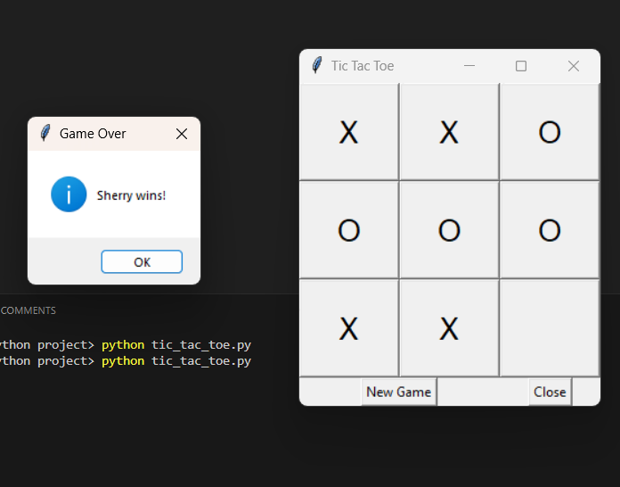

# Tic Tac Toe Game

This is a simple Tic Tac Toe game implemented using Python and the Tkinter library for the graphical user interface (GUI).

## How to Run

1. Make sure you have Python installed on your system.
2. Create a file named `player_names.txt` in the same directory as the script with the player names on separate lines, like this:
    ```
    Harry
    Sherry
    ```
3. Run the script using the following command:
    ```sh
    python [tic_tac_toe.py](http://_vscodecontentref_/7)
    ```

## Code Explanation

### Imports

- `tkinter as tk`: Imports the Tkinter library for creating the GUI.
- `from tkinter import messagebox`: Imports the messagebox module for displaying messages.

### TicTacToe Class

- `__init__(self, master)`: Initializes the game, sets up the GUI, and reads player names from a file.
- `read_player_names(self)`: Reads player names from a file named `player_names.txt`. If the file is not found, it defaults to "Harry" and "Sherry".
- `make_move(self, index)`: Handles a player's move, updates the board, checks for a winner, and switches the current player.
- `check_winner(self)`: Checks if there is a winner by comparing the board's current state with predefined winning combinations.
- `new_game(self)`: Resets the game board and starts a new game.

### Main Program

- Creates the main Tkinter window and starts the game.

## Example

Here's an example of how the game looks:



Enjoy playing Tic Tac Toe!